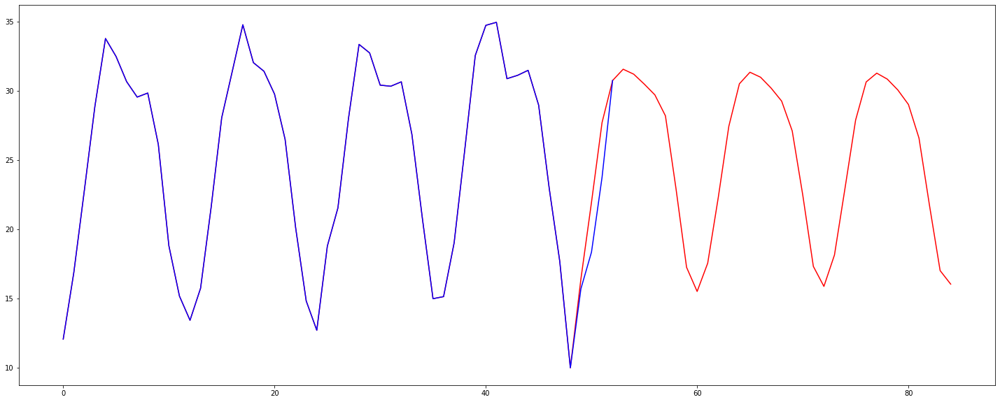

# Experiments with LTSM networks

## Delhi climate dataset

This notebook builds an LSTM model and then uses that model to predict the monthly mean temperature for the next 36 months. Each monthly prediction relies on the previous 9 monthly temperatures. The first prediction uses the last 9 values from the train dataset, the next prediction uses the last 8 values + first prediction, the next uses the last seven values + first 2 predictions and so on. Eventually, we have predictions being made on previous predictions only. Plenty of scope for hyperparameter tuning and cross validation during fitting but not included here.

Predicting the mean temperature using a Long Short Term Memory network.

